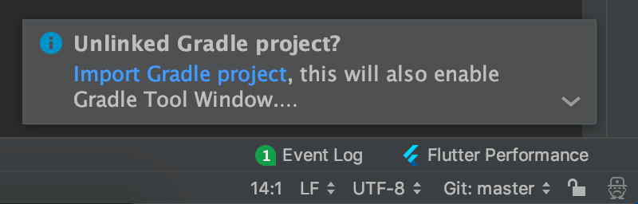
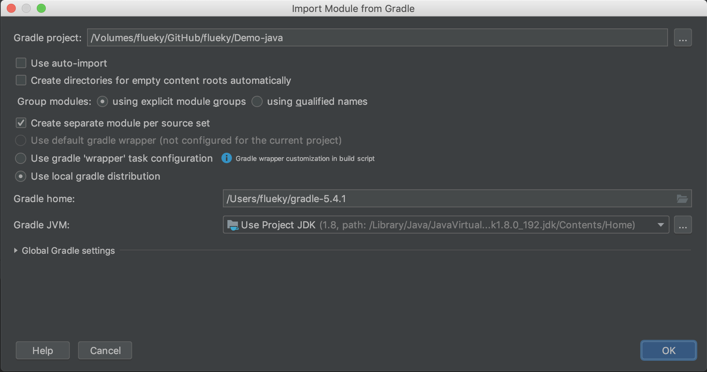
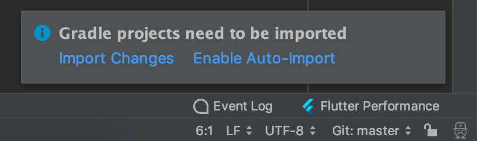

## Gradle 构建 Java 工程 

### 创建工程

创建 Demo-java 文件夹

创建 settings.gradle 文件，编辑内容：

```gradle
rootProject.name = 'Demo'
```

创建 build.gradle 文件，编辑内容：

```gradle
// 用于全部模块的一些通用配置
allprojects {

}
```


Project Settings 中 指定 jdk 版本。


重新使用 idea 打卡工程，右下角提示：



点击 Import Gradle project ，见图中配置 ：



修改 gradle 文件，右下角有提示：



点击 Enable Auto-Import 。

或者在右边 gradle 工具栏中右键 Demo ，可控制开启 Auto-Import 。


通常的 Java 工程中，src libs 文件夹直接在根目录下，此处不建议这么配置。建议使用模块的概念。

### 创建模块

创建文件夹 main ，做主模块。

在 main 中创建 build.gradle 文件，默认是 java 工程，因此编辑内容：

```gradle
apply plugin: 'java'
```

在 main 中，依次建立文件夹 src 存放资源文件（包括代码），建立文件夹 libs 存放 jar 文件。再建立文件夹 src/main/java 存放 java 代码，src/main/resources 存放资源文件。

自此，一个模块建立完成。
 
 