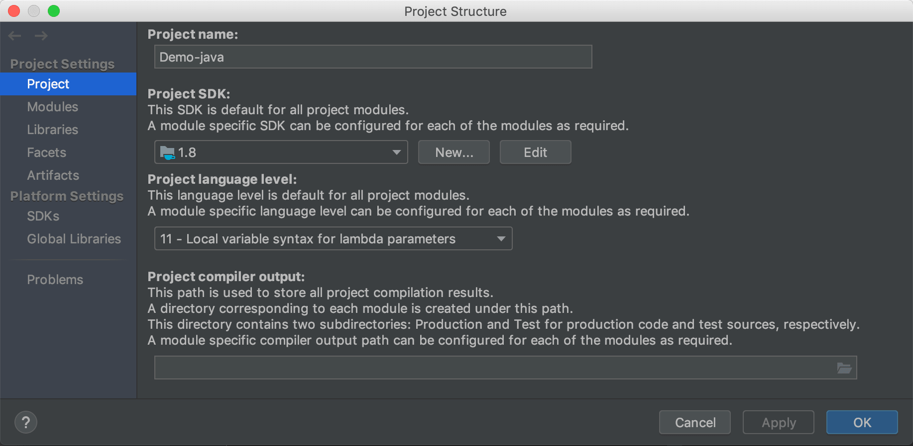
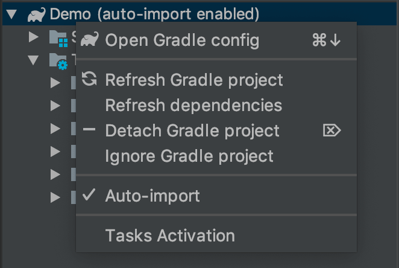

## Gradle 构建 Java 工程 

### 版本说明

|版本号|版本说明|
|:--:|:--|
|v0.0.1|简单的Java工程示例|

### 创建工程

创建 Demo-java 文件夹

创建 settings.gradle 文件，编辑内容：

```gradle
rootProject.name = 'Demo'
```

创建 build.gradle 文件，编辑内容：

```gradle
// 用于全部模块的一些通用配置
allprojects {

}
```


Project Settings 中 指定 jdk 版本。



重新使用 idea 打卡工程，右下角提示：


点击 Import Gradle project ，见图中配置 ：


修改 gradle 文件，右下角有提示：


点击 Enable Auto-Import 。

或者在右边 gradle 工具栏中右键 Demo ，可控制开启 Auto-Import 。



通常的 Java 工程中，src libs 文件夹直接在根目录下，此处不建议这么配置。建议使用模块的概念。

### 创建模块

创建文件夹 main ，做主模块。

在 main 中创建 build.gradle 文件，默认是 java 工程，因此编辑内容：

```gradle
apply plugin: 'java'
```

在 main 中，依次建立文件夹 src 存放资源文件（包括代码），建立文件夹 libs 存放 jar 文件。再建立文件夹 src/main/java 存放 java 代码，src/main/resources 存放资源文件。

建立 test 文件夹存放测试资源。

自此，一个模块建立完成。

同样的方式建立 library module，用于演示 maven 使用。

### 关联依赖

在  settings.gradle 中添加外部工程引用。

```gradle
// 添加外部工程依赖示例
//include 'libModule'
//project(':libModule').projectDir = new File(settingsDir, "../library")
```

在 module 的 build.gradle 文件中添加依赖。

```gradle
dependencies {
    // 依赖本地 lib 目录
    compile fileTree(dir: 'libs', include: ['*.jar'])
    // 依赖 module
    compile project(':module')
    // 依赖外部 module，见 settings.gradle 配置
    compile project(':libModule')
}
```

###  添加 maven 

使用 maven ，主要是方便依赖管理。也可以将自己的 module 导出到 maven 仓库。

在 module 的 build.gradle 中编辑：

```gradle
// 远程库名称通常由三部分构成 ，groupId:artifactId:version
// 定义 group
group = 'com.flueky'
// 定义 version
version = '1.0.0' // 指定版本
 artifactId 默认使用 module name

// 以上两个配置也可以在下面的 deployer 中定义

// 下面定义三种不同的 maven 仓库地址
// 1. 计算机中，用户目录下
def localMavenRepo = 'file://' + new File(System.getProperty('user.home'), '.m2/repository').absolutePath
// 2. 工程目录下
def projectMavenRepo = 'file://' + rootDir.getAbsolutePath() + '/repository' // 等同 uri('../repository')
// 3. 自建的 Maven 私服上
def nexusMavenRepo = 'http://127.0.0.1:9000/repository/android/'
// 下面是 Maven 私服的用户名和密码，上传时需要
def nexusUserName = 'admin'
def nexusPassword = 'admin123'

uploadArchives {
    repositories.mavenDeployer {
        // 指定导出到的仓库地址，三个任选一个
        repository(url: localMavenRepo)
        repository(url: projectMavenRepo)
        repository(url: nexusMavenRepo) {
            // 需要授权用户名和密码
            authentication(userName: nexusUserName, password: nexusPassword)
        }
        // 下面三个定义的常量可以复写上面已定义的值
        pom.groupId = "com.flueky"// 唯一标识（通常为模块包名，也可以任意）
        pom.artifactId = "maven-test" // 项目名称（通常为类库模块名称，也可以任意）
        pom.version = "1.0.0" // 版本号
    }
}
```

上面配置了三个 maven 仓库地址，对应在工程 build.gradle 文件中使用三个仓库地址。

```gradle
allprojects {
    repositories {
        // 本地仓库
        mavenLocal()
        // 工程目录仓库
        maven { url 'file://' + rootDir.getAbsolutePath() + '/repository/' }
        // 本地服务器
        maven {
            credentials {
                username "flueky"
                password "123456"
            }
            url 'http://127.0.0.1:9000/repository/android/'
        }
```

以上三个配置，根据场景任选一个使用。

1. 本工程目录下，其他 module 依赖 ，可以使用工程目录仓库。
2. 本机中其他工程使用，可以使用本地仓库。
3. 多计算机间共享使用，可以使服务器。对应工具 nexus 。

依赖方式：`compile groupId:artifactId:version`

